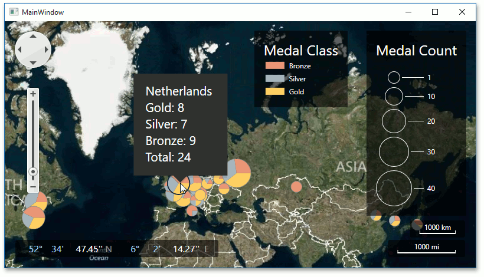

<!-- default badges list -->

<!-- default badges end -->

# WPF MapControl - Add Analytical Data to a Geographical Map

This example demonstrates how to add analytical data to a geographical map.

## Files to Review

* **[MainWindow.xaml](./CS/Wpf_MapControl_Lesson3/MainWindow.xaml) (VB: [MainWindow.xaml](./VB/Wpf_MapControl_Lesson3/MainWindow.xaml))**

## Documentation 

* [Lesson 3 - Add Analytical Data to a Geographical Map](https://docs.devexpress.com/WPF/17751/controls-and-libraries/map-control/getting-started/lesson-3-add-analytical-data-to-a-geographical-map)
<!-- feedback -->
## Does this example address your development requirements/objectives?

 

(you will be redirected to DevExpress.com to submit your response)
<!-- feedback end -->
